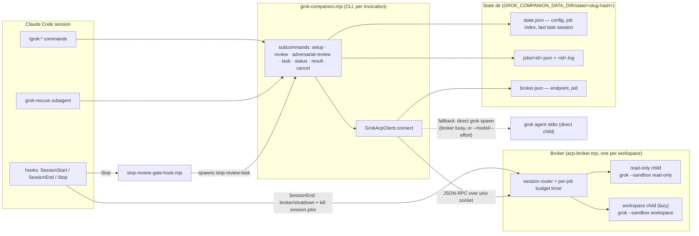
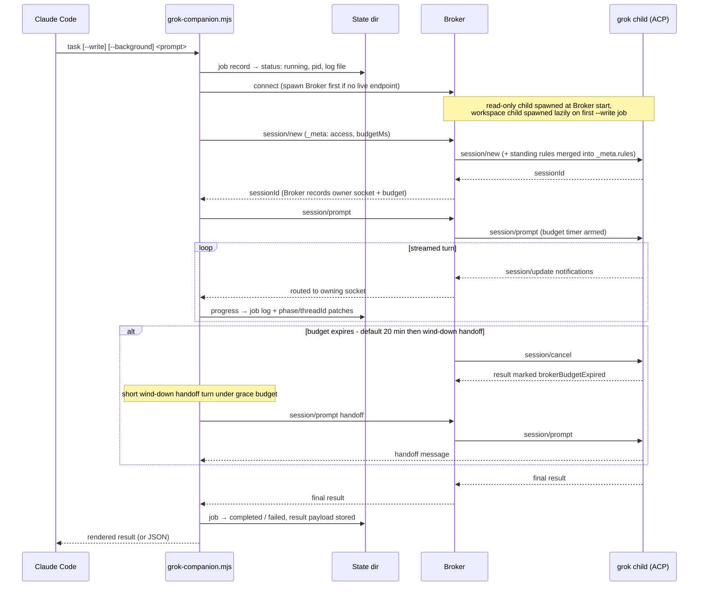
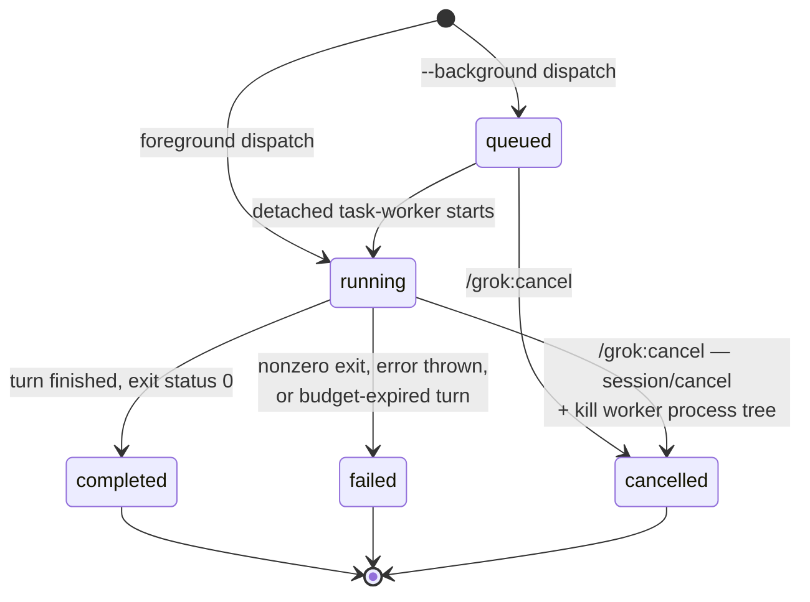
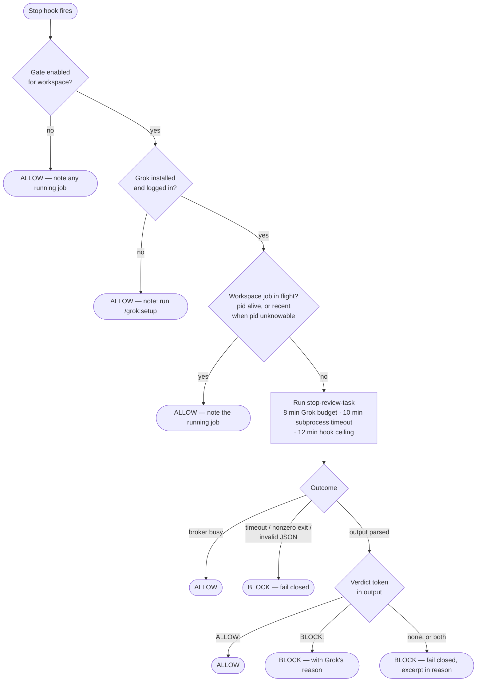

# Architecture

Visual companion to the README's [How it works](../README.md#how-it-works). Terms follow [CONTEXT.md](../CONTEXT.md). Sources of truth are cited per diagram; if a diagram and the code disagree, the code wins — fix the diagram.

## Component map

Where each piece lives and what talks to what.

Notes, from `acp-client.mjs` (`GrokAcpClient.connect`) and `session-lifecycle-hook.mjs`:

- The Broker is the default path, but not the only one. `--model` or `--effort` forces a **direct** `grok` spawn (sandbox profile still applies), and a busy/unreachable Broker falls back to a direct spawn unless `brokerFallback` is disabled (the stop-review gate disables it so it can detect "busy" instead).
- The Broker is single-flight: one request socket at a time; concurrent callers get a `broker busy` RPC error.
- Broker clients verify `_meta.broker: "grok-companion"` during `initialize`. A foreign persisted endpoint is discarded and the current request falls back to a direct Grok child.
- `SessionEnd` sends `broker/shutdown` only after the same identity check, kills this session's queued/running job processes, and removes their records.
- `SessionStart` copies Claude's plugin-scoped data path into `GROK_COMPANION_DATA_DIR`; exporting a Grok-specific name prevents another plugin's hook from redirecting Grok state.

## Job dispatch sequence

The full path of a foreground `/grok:rescue` (a `task` Job). Reviews follow the same path with the read-only child and a review prompt. Source: `grok-companion.mjs` (`handleTask`/`executeTaskRun`), `acp-broker.mjs` (`routeRequest`), `tracked-jobs.mjs` (`runTrackedJob`).

Background variant (`--background`): `handleTask` writes a `queued` job record, spawns a detached `task-worker` process, and returns immediately; the worker re-reads the stored request and runs the same `executeTaskRun` path. Write jobs additionally require a clean working tree before queueing.

## Job lifecycle

States are the `status` field on job records; every transition is written to both `state.json` and `jobs/<id>.json`. Source: `tracked-jobs.mjs` (`runTrackedJob`), `grok-companion.mjs` (`enqueueBackgroundTask`, `handleCancel`), `session-lifecycle-hook.mjs` (`cleanupSessionJobs`).

How the commands relate to states:

- `/grok:status` reads all states; `--wait` polls until the job leaves `queued`/`running`.
- `/grok:result` only resolves `completed`/`failed`/`cancelled` jobs; an active job is an error.
- `/grok:cancel` only accepts `queued`/`running` jobs.
- `SessionEnd` kills and deletes this session's `queued`/`running` jobs outright (no `cancelled` record survives — the records are removed).
- Jobs also carry a finer-grained `phase` (starting → investigating/reviewing/editing/verifying → finalizing → done) used only for status display; `status` is the state machine.

## Stop-review gate decision flow

What happens on every `Stop` hook fire when deciding whether Claude Code may end the turn. Source: `stop-review-gate-hook.mjs` (`main`, `runStopReview`, `parseStopReviewOutput`).

The asymmetry is deliberate: *infrastructure absence* fails open (gate off, Grok not set up, Broker busy) while *review failure* fails closed (timeout, crash, unparseable verdict). The escape hatch is `/grok:setup --disable-review-gate`.
